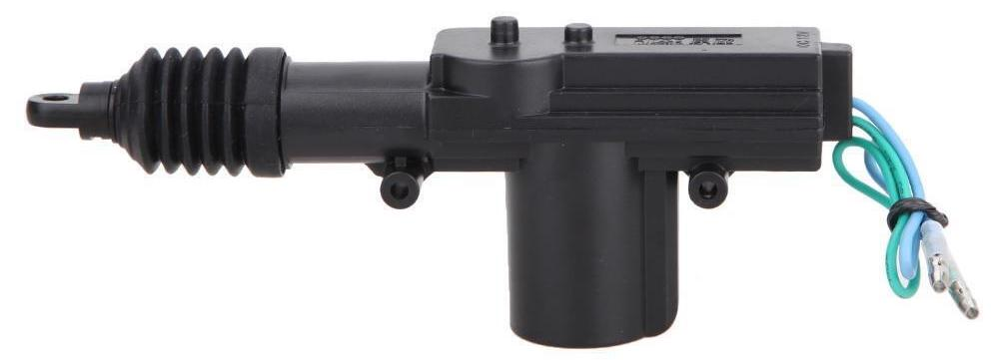

# Kick-Bot Mechanism

Image: Kick-Bot mechanism mounted on a modified kick drum pedal attached to a 16" kick drum.

I recommend using the riser frame of a "donor" kick pedal, removing the actual pedal and pull chain. What remains is the beater, hex axle, riser frame and drum clamp. To this, I've added a bracket to mount the linear actuator (a 12v, car door lock motor) and a push lever to fit onto the hex axle.

The 3D modelling files are as follows:-
- [KickActuatorPushrod.scad]() The OpenSCAD 3D model pushrod on the hex axle. (Importable to many other CAD programs.)
- [KickActuatorPushrod.stl]() The slicer-ready mesh model for 3D printing.
- [KickActuatorMount.scad]() The OpenSCAD 3D model of the motor bracket. (Also importable to other CAD programs.)
- [KickActuatorMount.stl]() The slicer-ready mesh model for 3D printing.

PLA will probably eventually weaken and fail. I'm using PETG as it's nearly as strong as and less toxic than ABS, as well as lightly more elastic than PLA or ABS and much easier to print on a basic machine than ABS. The SCAD model could also be used to machine a metal bracket out of aluminium channel or square hollow, either with hand tools or with a suitable CNC router.

I used this linear actuator...
[ links to eBay search](https://www.ebay.com.au/sch/i.html?_nkw=car+door+lock+actuator&_sacat=131090&_sop=15&_svsrch=1)