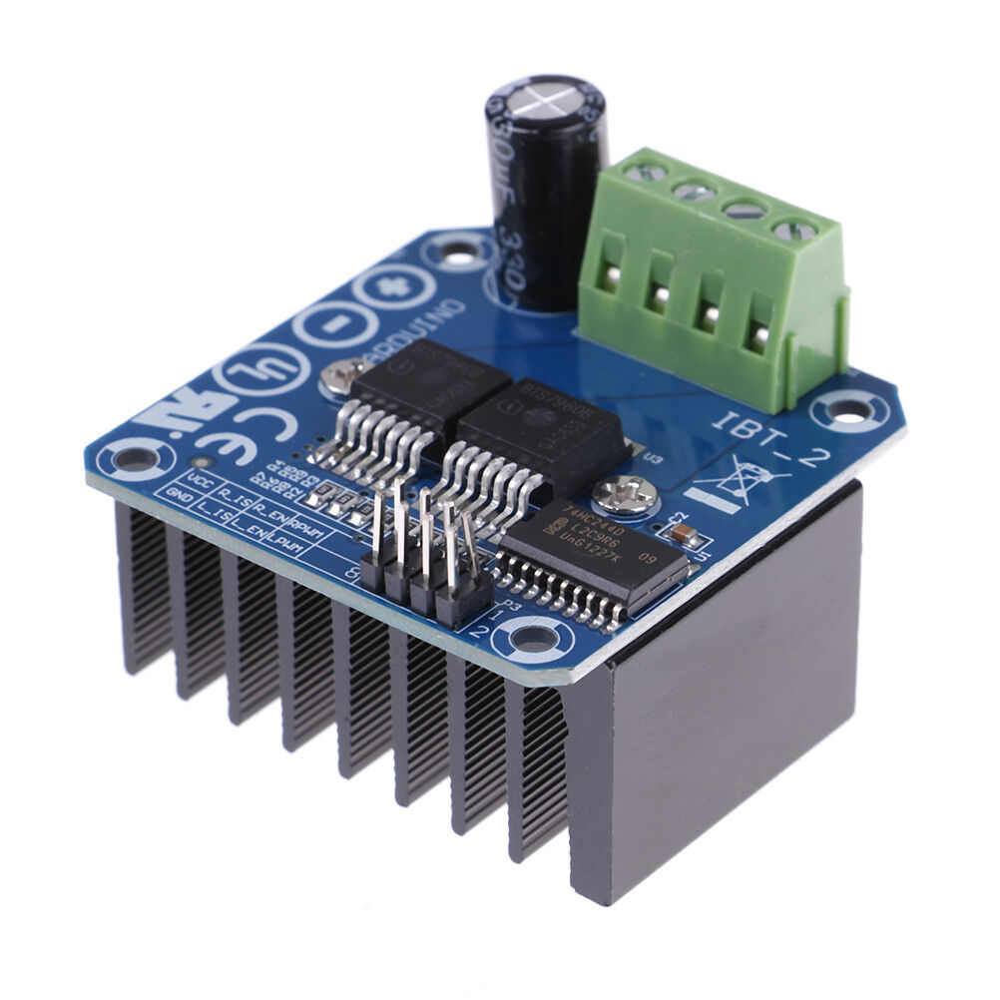

# Table of Contents
  * [Wristy-Bot Mechanisms](#wristy-bot-mechanisms)
  * [Workshop-Friendy Metal Mech](#Workshop-Friendy-Metal-Mech)
  * [Kick-Bot](#kick-bot)
  * [Stick-Bot](#stick-bot)
  * [Hat-Bot](#hat-bot)
  * [Electronics](#electronics)

# Wristy-Bot Mechanisms

There are 3 basic mechanisms, [Kick-Bot](./Kick-Bot), [SnareMount](./SnareMount) and Hat-Bot, the latter being still in development. The files kept here, in the appropriate folders are the OpenSCAD CAD files for use as is, or for importing into your CAD software of choice for parametric mods to suit your kit.

Much of the scope of this project is to use logic to ensure signals from the drum machine are played how a human would play the piece. For example, if a snare right and hi-hat right are called at the same time, the hi-hat beat will be diverted to the left stick on the hats, causing repeated left hits to maintain the beat. This is part of what will generate a "human" feel.

## Kick-Bot

Kick-Bot operates the kick drum beater and will respond to MIDI 35 and 36 in single kick mode, with 35 being a hit-and-rebound, 36 being a hit and hold. The hold will have a timeout so that the actuator and power control don't burnout. In double kick and two kicks mode, one beater will be driven by MIDI 35, the other by 36.

## Stick-Bot

Stick-Bot is the general workhorse of the system. More or less using the same hardware on drums, cymbals and other percussion as required. As part of the snare drum mechanism, it will be configurable with two sticks, using MIDI 38 and 40, and an option stick on the rim, using MIDI 37, "sidestick", in unison with MIDI 38 for a rimshot. This third stick will also be configurable as an actual sidestick sound on the side of the drum.

For other drums, it will be up to your needs to decide on double or single stick setups. Two stick-bots will also be needed for the hi-hat rig, also as a left and right stick, alternating based on the last stick that operated (left-right-left-right) and whether a snare hit was called (left or right), flicking the next due hit to the opposite.

## Hat-Bot

Hat-Bot will consist of 2 stick-bots and a hi-hat lifting mechanism, powered by a high torque digital servo motor. Hat-Bot is still under development.

## Electronics

### Arduino or Others

My plan is to use Arduino Nanos as the MIDI to mech translators, but I've also done test builds of the proof-of-concept firmware on a [Wio Terminal](https://wiki.seeedstudio.com/Wio-Terminal-Getting-Started/), which has a built in TFT screen and loads of GPIOs. It also runs a SAMD25 core, so its pretty fast with it. I'm building mine on a tight budget, so I'm using third party nanos at around AU$10 (US$7), but if you can spare 8* the figure per drum-bot module, go for it. Any micro will do the job.

### Motor Power Control.

I was planning to design and build my own H-Bridge, and the design works in simulation, but the mosfets alone were going to blow out to $30, and the idea of frying a few while solving some of the more practical construction problems felt a little uncomfortable. Luckily, there is the [BTS7960B high current H-Bridge](https://www.ebay.com/sch/i.html?_nkw=bts7960b&_fcid=15&_sop=15&_stpos=3204&_svsrch=1&rt=nc&LH_PrefLoc=98) and this baby is around 12 of my currency's bucks, delivered. It means a housing with 2 boards in it, but I can guarantee reliability with this board, and most come with the heatsink included.

The purpose of the H-Bridge is to drive the actuators forwards (drive) on a beat and backwards (park) on MIDI NoteOff. The selected H-Bridge switch the supply through the motor bidirectionally and also to vary the motor drive using PWM with a duty cycle proportional to the MIDI velocity value, such that a MIDI velocity value of 1 provides the minimum drive to just touch the drum skin and a MIDI velocity value of 127 provides full voltage across the motor. MIDI Velocity 0 of course equals NoteOff.
