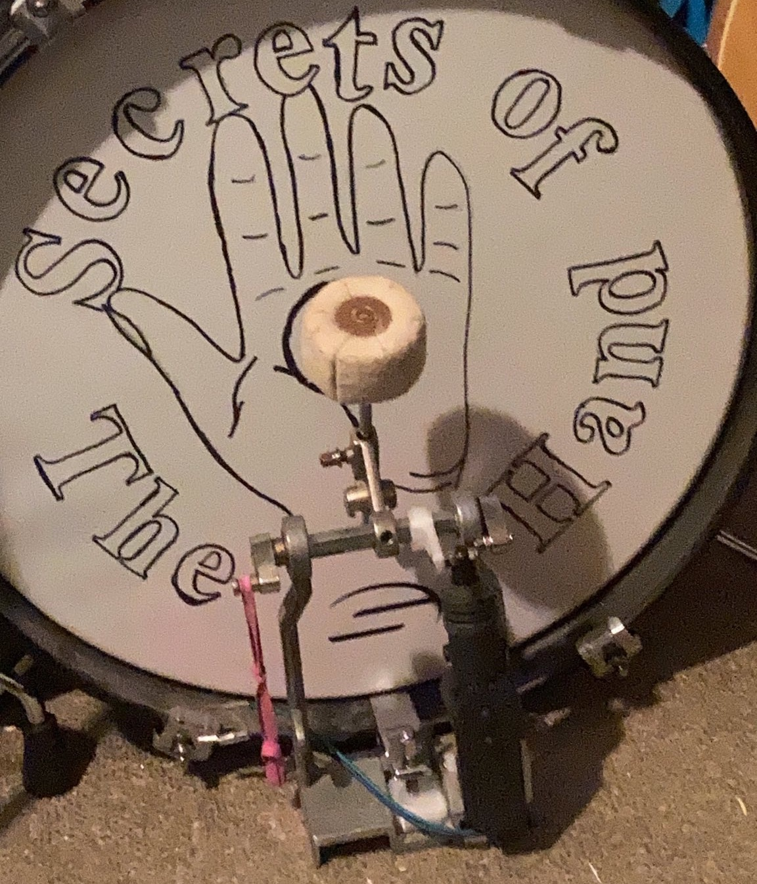
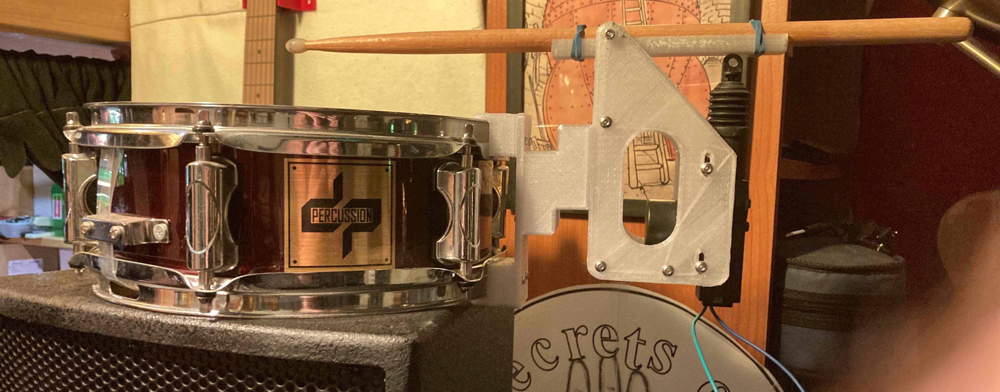

# Wristy-Bot

Image: Kick-Bot mechanism mounted on a modified kick drum pedal attached to a 16" kick drum.
 
Arduino code and OpenSCAD drawings for a modular, adaptable robotic drum kit powered by MIDI input. There are three main principles to the project, the wrist-flick, modular design and adaptablity. This will allow almost any amount of drums, in almost any configuration, to be powered by any computer, sequencer or drum machine. Be it a rehearsal aid the a slightly more "human" feel, or a major, distributed art installation Wristy-Bot will be adaptable to your needs.

Preliminary code and designs will be added over the next few days, as it is tidied up a little. CAD drawings are in OpenSCAD format. .scad files can be imported into FreeCAD and many other CAD programs if you need to work in a visual environment.

## Why "Wristy-Bot"?
Human drummers, well, good ones, at least, use a wrist-flick action, holding the stick near its balance point, cradling the back of the stick on their ring and pinky fingers. Propulsion stops just before the stick hits the skin, and the standard grip allows the stick to continue rotating until it hits the skin, rebounds and comes back to rest with the back of the stick on the minor fingers. While the CAD drawings with this repo show a much simpler mechanism than the human hand and wrist, the principle is the same - a sharp impulse force propells the tip of the stick towards the drum, but not driving the stick into the drum, instead allowing it to rotate beyond the actuator limit, then strike and rebound. The mechanism allows the "underbalanced" stick to repark itself by falling back to it's natural rest, with the help of the rebound as well as the balance of the stick.

## Modular Design

Image: Stick-Bot mechanism mounted on a 10" wood snare.

The aim of this project is to create a public document that will help musicians with a modicum of microcontroller skills, or with a friend with said skills, to build a robotic drum kit, driven by a MIDI enabled drum machine or computer DAW (such as Logic Pro X or Ableton), such that one can practice with the more natural sound of real drums. The desire is to create an archive of firmware code, STL files for a set of 3D printable parts to mount the stick, beater and hi-hat mechanisms on mostly standard drum hardware. Each drum stick mech will be a standalone instrument, setup in firmware to read only the relevant MIDI codes for the drum it plays. All of the physical parts, such as the microcontroller, car door lock actuators and power control modules are readily available on eBay and Ali Express, and a recommended BOM will also be included with suggested search terms.

## Adaptable To Any Drum Kit
The modular design, allowing the project to be built up and added to each drum or other drum kit parts, makes for adaptability to 4 piec, 5 piece or more, with each drum-bot module being daisy-chaned via hardware MIDI thru, waiting for and responding only to its relevant MIDI codes - eg the snare waits for MIDI Snare 1 or Snare 2 and MIDI Sidestick commands, using Snare 1 for left stick and Snare 2 for right stick, with a third stick that can either be set up to strike a rim shot or a side stick, programmed in the drum machine to strik in unisone with the left or right sticks. The kick drum will be setup to read Kick 1 as kick with rebound or Kick 2 as a dmaped kick, where the pedal is held against the skin to damp the beat. DOOF or duf, respectively. If you can imagine a way you'd like a drum kit played, you'll be able to adapt the code, designs and operation to suit the playing style. Using an existing drum machine or DAW adds even more flexibilty.

## Housekeeping
Of course, for any of this to be useful, it all needs to be understandable, simple, free and open source. If there's a commercial component to the music or art you make, that's fine, the art *created* by any user is not part of, nor affected by the licence. If you want to manufacture systems based on code, designs and parts, there is an additional, commercial clause added to the MIT licence. This doesn't exclude mass production, but it makes a strict requirement to negotiate a licence from project contributors and payment to the project collective. This licence will apply to all forks.

Cheers,
Crunchy
