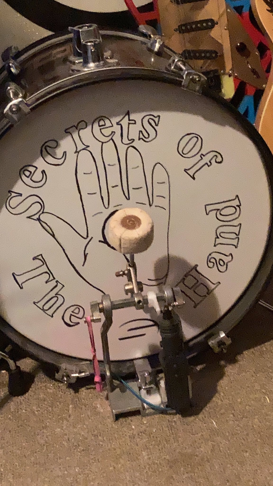

# Wristy-Bot Hardware Models
In generalising a modular drummer bot, some standard components will be needed to mount the car door lock linear actuators. These files provide the prototype designs. OpenSCAD files can be imported into many, more conventional CAD software. I use OpenSCAD because it's free and allows me precise mathematical control over repeating sub-modules. The STL files included are for those confident enough in my designs to go direct to print.

## Kick-Bot

Kick-Bot modified drum pedal, showing the actuator on its bracket and the pushrod on the hex-axle to drive the beater.

OpenSCAD files for Kick-Bot

- [KickActuatorPushrod.scad](KickActuatorPushrod.scad) This lever mounts on a modified kick drum pedal's hex-axle. For those who need to adapt the design to variations in how their kick pedal works. Removing the actual pedal and drive chain is recommended.

- [KickActuatorPushrod.stl](KickActuatorPushrod.stl) The slicer-ready file of the above for your 3D printer's slicer software.

- [KickActuatorMount.scad](KickActuatorMounted.scad) This bracket is where the linear actuator mounts on a modified kick drum pedal's hex-axle. For those who need to adapt the design to variations in how their kick pedal works. Removing the actual pedal and drive chain is recommended.

- [KickActuatorMounted.stl](KickActuatorMounted.stl) The slicer-ready file of the above for your 3D printer's slicer software.

## Kick-Bot
OpenSCAD files for Stick-Bot will follow.